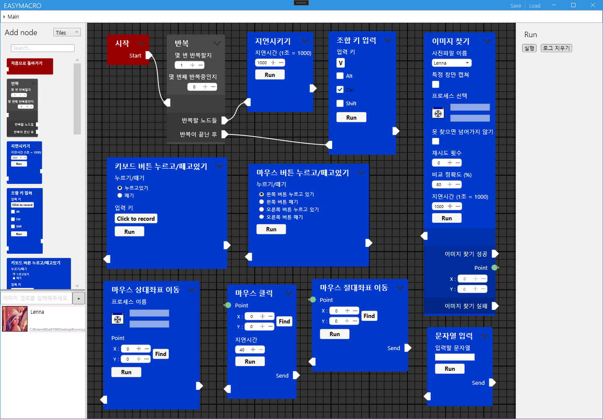

# EasyMacro

> [그림판(ms-paint)](https://en.wikipedia.org/wiki/Microsoft_Paint)으로 누구나 쉽게 사진을 편집할 수 있습니다. 이처럼,  
매크로를 만드는것도 그림판을 사용하는것 처럼 쉬워야합니다.

노드를 도구상자에서 끌어 배치함으로써  
간단하게 윈도우 제어 매크로를 생성/편집 할 수 있습니다.

# Frature (특징)
* Built for .NET 5.0 or newer  
(닷넷 5.0 이상으로 구축되었습니다)

# About this project (이 프로젝트에 대해)

This project started as a comprehensive design team project in the Department of Computer Science and Engineering, [Inje University](https://www.inje.ac.kr/english/).  
(인제대학교 컴퓨터공학과 종합설계 팀프로젝트로 시작된 프로젝트입니다.)

